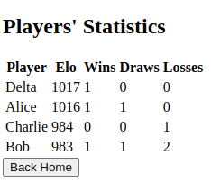

# chess_server

Server for local and persistent ELO ranking.

## Setup

Run:
```bash
source setup_venv.sh
```

## Deploy server

Run:
```bash
source .venv/bin/activate
chess_server
```

## UI

The user can interact with the server through an HTML page.

### Record a new game result

Through a form on the homepage.


### View all the players' statistics

On the `stats` URL route.


